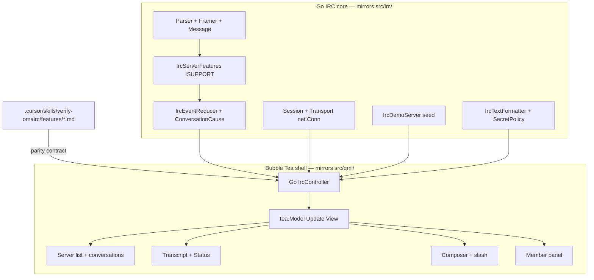

# Omairc TUI port — phased plan

## Goal

Ship `omairc-tui` in the same repository as the Qt app, with **exact feature and keybinding parity**, on Omarchy/Linux first, plus Windows Terminal and macOS. The Qt app stays alive; the TUI is additive. The feature map under `.cursor/skills/verify-omairc/features/*.md` is the single source of truth both implementations are verified against.

## Why the phases are ordered this way

The C++ code already splits cleanly along the right seam:

- `src/irc/` — portable IRC core: parser, framer, case mapping, server features (ISUPPORT), event reducer, session, models, demo server, secret policy, text formatter. This is reimplemented faithfully in Go with identical semantics.
- `src/qml/` + `src/OmaircWindow.qml` — presentation only. Reimplemented in Bubble Tea; none of its internals transfer.

So the port builds the **Go IRC core first** (phases 1–3), then a **thin Bubble Tea shell** over it (phase 4), then **layers features in dependency order** (phases 5–11). Each phase is verifiable against the matching feature file and never rewrites the layer below it.

## Shared contract (must not drift between Qt and TUI)

- **Behavioral spec** — the 17 feature files are implementation-agnostic. Both `control-omairc` (Qt driver) and a new `control-omairc-tui` driver play the same `desktop-recipe` fences.
- `**IrcConversationCause**` — insertion rules in `ircConversationCauseInserts` (UserOpen invents DMs; ChannelState invents channels; InboundOther invents channels and non-service DMs; Restore invents non-service DMs after ISUPPORT; QuietSend/InboundSelf never invent). Port verbatim; do not invent a second policy.
- `**IrcServerFeatures**` — never hard-code CHANTYPES, CHANMODES, or PREFIX; parse ISUPPORT. Case mapping, `parseNamesToken`, `prefixChanges`, `rankPriority`, `memberLabel` must match.
- `**IrcSecretPolicy**` — redaction for Status/error previews fails closed. Port `redactWireLine` / `redactPreviewLine` / `redactMessage` exactly.
- **Member ordering** — `orderedMembers` sorts by PREFIX rank then nick, in the core (never in the view).
- **Version** — one shared `--version` / CTCP `VERSION` source (`version.pri`, `CHANGELOG.md`, `tests/test_derive_build_versions.py`). A release bump touches both binaries atomically.

## Phases

### Phase 0 — Scaffolding and shared contract

- Create `tui/` with its own `go.mod` (module e.g. `omairc/tui`), Go 1.23+, and layout:
  - `tui/internal/irc/` — portable core (mirrors `src/irc/`)
  - `tui/internal/ui/` — Bubble Tea shell (mirrors `src/qml/` + `OmaircWindow.qml`)
  - `tui/cmd/omairc-tui/` — `main.go`, flags (`--demo-server`, `--version`, `--help`)
  - `tui/bin/test` — TUI gate (go vet + go build + go test)
- Pin the stack: `charm.land/bubbletea/v2`, `charm.land/lipgloss/v2`, `charm.land/bubbles/v2`, `github.com/ergochat/irc-go` (`ircmsg`, `ircreader`, `ircfmt`, `ircutils`).
- Version plumbing: a generator that reads `version.pri` (or a new shared `VERSION` file) so `omairc-tui --version` and CTCP `VERSION` match Qt.
- CI skeleton: `.github/workflows/tui.yml` (build + test on Linux/macOS/Windows). Add `tui/AGENTS.md` for TUI-scoped conventions.

### Phase 1 — IRC protocol core (pure Go, no UI)

Hand-port the wire layer faithfully, with the existing test matrices as the
spec. Decision: **do not** import `irc-go/ircmsg` + `ircreader` here. A
hand-port keeps `internal/irc` byte-for-byte with `src/irc/` and lets the
mirrored `tests/protocol/` and `tests/session/tst_capability.cpp` matrices be
the contract. The irc-go import moves to Phase 10 (`ircfmt`) and later
(`ircreader`).

- Message model, parser, framer — `src/irc/ircmessage.h`, `ircparser.*`,
  `ircframer.*` → `message.go`, `parser.go`, `framer.go`. `Parse` returns
  `(Message, error)` with an `Error` value instead of `IrcResult<Message>`.
- Case mapping — `irccasemapping.*` → `casemapping.go` (rfc1459, ascii,
  strict-rfc1459). Match `tests/protocol/tst_casemapping.cpp`.
- Server features / ISUPPORT — `ircserverfeatures.*` → `serverfeatures.go`
  (`ApplyToken`, `ParseNamesToken`, `PrefixChanges`, `RankPriority`,
  `MemberLabel`). Do not hard-code PREFIX/CHANTYPES/CHANMODES.
- Capability negotiation — `irccapability.*`, `irccapabilitynegotiation.*` →
  `capability.go`, `capabilitynegotiation.go` (CAP LS/REQ/ACK/NAK/END, SASL),
  mirroring `tests/session/tst_capability.cpp`.
- Outbound builder — `irccommandbuilder.*` → `commandbuilder.go` (line, split,
  nick, user, pass, join, registration).
- CTCP, prefix nick, wire text — `irctcp.*`, `ircprefixnick.*`,
  `ircwiretext.*` → `ctcp.go`, `prefixnick.go`, `wiretext.go`.
- Corner corpus copied verbatim to `internal/irc/testdata/corpus/`.

Exit criteria: Go tests mirror `tests/protocol/` and pass.

### Phase 2 — Session and event reducer (state model)

- `IrcEvent` taxonomy — `src/irc/ircevent.h` (welcome, message, notice, action, join/part/quit/nick/kick, topic, names, mode, away, member metadata, account, typing, history, whois, channel error).
- `IrcEventReducer` — `src/irc/irceventreducer.*`: `apply(event)`, `ensureConversation` + `IrcConversationCause`, unread/mention bookkeeping, `orderedMembers`, presence (`ircpresence.*`), typing (`irctyping.*`), muted set, 2000-message cap, msgid dedup.
- Transport and session — `src/irc/irctransport.h`, `qtirctransport.*` → `net.Conn` (TCP + TLS), `ircsession.*` (reconnect, MOTD/ISUPPORT tracking).
- Controller core — a Go `IrcController` with the same shape as `src/irc/irccontroller.h` (`conversations`, `messages`, `members`, `selectedConversationId`, `topic`, `peopleCount`, `connectionStatus`, `unreadCountFor`, `mentionFor`, `start`, `selectConversation`, `sendMessage`, `openDirectMessage`, `closeDirectMessage`). This is the single API the UI shell calls.

Exit criteria: Go tests mirror `tests/session/` and pass.

### Phase 3 — Demo server and loopback (parity seed)

Port `src/irc/ircdemoserver.*` so `omairc-tui --demo-server` seeds the **identical** world: two networks (`omarchy`, `oftc`), same nicks, autojoin, unread/mention states, `IrcLoopbackTransport` (in-process byte pipe instead of a socket).

This matters because the feature map's observables are seed-dependent: `Alt+A` lands on `#ricing`; `Ctrl+Shift+K` + `mira` then `Ctrl+W` selects `dax`; the member panel shows `fred`, `anna`, `dax`, etc. If the seed drifts, the shared map breaks.

Exit criteria: the Go seed produces the same conversation list, nick set, and unread state as Qt `--demo-server`.

### Phase 4 — TUI shell and parity gate

- Minimal Bubble Tea app: `Model`/`Update`/`View`, alternate screen, resize handling, one `Msg` type, shell layout (server list, transcript, composer, member column) reading from the Go `IrcController`.
- Bubbles v2 `textinput` for composer, `viewport`/`list` for transcript and sidebar.
- Establish the **parity gate**: a `control-omairc-tui` driver that plays the same `desktop-recipe` fences as `control-omairc`, asserting titles/screenshots. This prevents Qt/TUI drift from here on. (Qt driver uses Xvfb + xdotool; the TUI driver uses a PTY, e.g. `creack/pty`, feeding the same chord verbs.)
- Windows Terminal is the only Windows target (no legacy conhost/PowerShell). Watch Bubble Tea v2 Windows resize (fixed v2.0.6) and the open Lip Gloss border bug; test in Windows Terminal.

Exit criteria: `omairc-tui --demo-server` renders the seeded sidebar, `--version` matches Qt, and the parity gate can drive and screenshot the shell.

### Phase 5 — Connect and core conversations

Port `connect.md` and `switch-conversation.md`:

- Connect sheet: first-run overlay, Libera defaults, `Nick is required` + muted Apply, tab order, `Ctrl+Enter` apply, Preferences tab (reopen DMs, open-at-unread), Add/Remove/Forget network, Disconnect-on-live.
- Conversation list + switching (topic, people count, message history updated together), Status console, send/receive, draft-per-conversation.

Exit criteria: `connect.md` and `switch-conversation.md` fences pass.

### Phase 6 — Keyboard parity (full chord map)

Port `keyboard.md` verbatim:

- `Alt+Down/Up` walk, `Alt+Left/Right` network headers, `Alt+Shift+Left/Right` collapse, `Ctrl+Alt+Shift+Left/Right` collapse-all, `Alt+Shift+Up/Down` reorder.
- `Ctrl+K` jump, `Ctrl+Shift+O` link sheet, `Ctrl+Shift+K` nick jump, `Alt+A` unread, `Ctrl+Shift+A` inbox, `Tab` nick complete, `Up/Down` history, `Ctrl+Shift+P` members, `Ctrl+Shift+S` server-list collapse, `Ctrl+W` close DM, `Ctrl+/` shortcuts sheet, `Ctrl+,` Connect, paging (`PageUp/Down`, `Ctrl+Home/End`), `Ctrl+F` find, `Ctrl+C` copy.
- Modal rule: these chords are disabled while Connect or the shortcuts overlay is open.

Exit criteria: `keyboard.md` fence passes fully.

### Phase 7 — Slash commands and completer

Port `slash-commands.md` + `slash-complete.md`:

- Full catalog via a `IrcCommandDispatcher` port (`src/irc/irccommanddispatcher.*`, `irccommand.*`): `/me /join /part /nick /disconnect /clear /close /query /msg /topic /notice /away /back /autoaway /status /avatar /whois /ping /time /version /mode /kick /ignore /unignore /ignored /monitor /unmonitor /monitored /mute /unmute /muted /highlight /unhighlight /highlights /op /deop /voice /devoice /ban /invite /ns /cs /znc /raw /help /list`.
- Scope rules (channel-only verbs refuse on Status; empty `/whois`/`/ping`/`/time`/`/version` on a channel refuse; `/close` on a channel is rejected and stays in the composer).
- `/list` overlay with streaming `322` rows, fuzzy filter, sort-by-users, join.
- Slash completion (`src/irc/ircslashcomplete.*`): `/` + char lists verbs, Tab inserts, Escape dismisses, Up/Down navigate, alias resolution.

Exit criteria: `slash-commands.md` and `slash-complete.md` fences pass.

### Phase 8 — Members, presence, typing, DMs

Port `toggle-members.md`, `member-presence.md`, `typing.md`, `open-direct-message.md`:

- Member panel with `Ctrl+Shift+M` toggle, PREFIX-rank ordering via `orderedMembers`, away dimming, status lines, presence dots, capability gating (`hasAwayPresence`, `hasMemberStatus`, `hasTyping`).
- Typing ellipsis (channel + DM), `message-tags` gate.
- Open/create DM from a member row, `Ctrl+W` close + reselect, unread clearing.

Exit criteria: the four feature files pass.

### Phase 9 — Mentions, inbox, notifications

Port `mention-notify.md`, `inbox.md`:

- Desktop notification for unfocused mention/DM (Linux via D-Bus `org.freedesktop.Notifications`; macOS via osascript; Windows Toast optional/deferred).
- Session inbox sheet (`Ctrl+Shift+A`): walk rows, Enter activate, Delete dismiss, Escape close.

Exit criteria: `mention-notify.md` and `inbox.md` pass.

### Phase 10 — Formatting, links, avatars

- `IrcTextFormatter` port — `src/irc/irctextformatter.*` (bold/italic/underline/color → Lip Gloss styles), plus `plainIrcText`/`emphasizedIrcText`/`hasIrcEmphasis`.
- URL policy — allowlisted `http`/`https`, `openAllowedUrl`, link sheet (`open-links.md`), INVITE channel join.
- Avatars — identicon default (nick + palette hash, like `OmaircStyle.nickColor`) and half-block truecolor via `github.com/blacktop/go-termimg` for real avatars (`ircavatarurl`, `ircavatarstore`, `ircavatarhttp`). Windows Terminal = half-block path (no kitty/sixel); skip native image protocols for v1.

Exit criteria: `open-links.md` passes; avatars render as identicons everywhere and half-block raster on truecolor terminals.

### Phase 11 — Preferences, persistence, restore, secrets

- `/pref` toggles (directs, avatars, unread) — `src/irc/ircpref.*` + `ircstatusentry`; global prefs apply without Apply.
- Profile store + storage path — `src/irc/ircprofilestore.*`, `ircstoragepath.*` (respect XDG state/config; map macOS `GenericConfigLocation`/`GenericStateLocation` and Windows `%LOCALAPPDATA%`).
- Open-direct restore after ISUPPORT, and bouncer playback — `src/irc/ircplaybackcoordinator.*`, `ircplaybacktime.*`, `ircconversationlog.*`.
- Secret redaction for Status/error previews — `src/irc/ircsecretpolicy.*` fail-closed.

Exit criteria: restart restore, `/pref`, and redaction tests pass.

### Phase 12 — Packaging, release, and CLI (deferred)

- Package as a single static binary: Homebrew formula (new path, not `Casks/omairc.rb` which is the Qt cask), scoop/portable for Windows, `go install` for Linux.
- Release: bump the shared version source (`version.pri`, `CHANGELOG.md`, `tests/test_derive_build_versions.py`) atomically so Qt and TUI ship together.
- CLI: **deferred**. The `omairc` CLI (`connections`/`status`/`send`/`read`/`names`/`raise`) drives the running Qt window over IPC; a TUI equivalent needs its own attach/IPC model and is a design decision to revisit after the core is proven. Not required for feature parity.

## Open decisions to resolve later (do not block phases 0–3)

- Whether the product CLI is ported (currently deferred).
- Native image protocols (kitty/sixel) vs half-block-only for avatars — v1 ships half-block + identicon.
- Windows Toast notifications — optional, can be omitted from v1.

