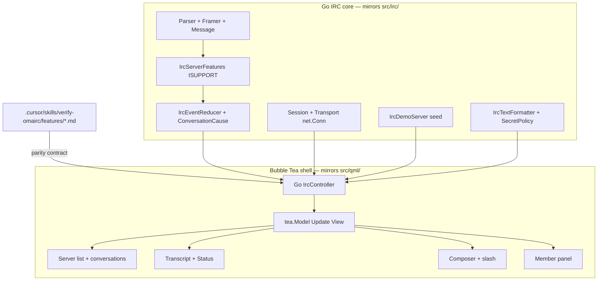

# Omairc TUI port — phased plan

## Goal

Ship `omairc-tui` in the same repository as the Qt app, with **exact feature and keybinding parity**, on Omarchy/Linux first, plus Windows Terminal and macOS. The Qt app stays alive; the TUI is additive. The feature map under `.cursor/skills/verify-omairc/features/*.md` is the single source of truth both implementations are verified against.

## Why the phases are ordered this way

The C++ code already splits cleanly along the right seam:

- `src/irc/` — portable IRC core: parser, framer, case mapping, server features (ISUPPORT), event reducer, session, models, demo server, secret policy, text formatter. This is reimplemented faithfully in Go with identical semantics.
- `src/qml/` + `src/OmaircWindow.qml` — presentation only. Reimplemented in Bubble Tea; none of its internals transfer.

So the port builds the **Go IRC core first** (phases 1–3), then a **thin Bubble Tea shell** over it (phase 4), then **layers features in dependency order** (phases 5–11). Each phase is verifiable against the matching feature file and never rewrites the layer below it.


```mermaid
flowchart TD
    subgraph core [Go IRC core — mirrors src/irc/]
        Parser[Parser + Framer + Message]
        Features[IrcServerFeatures ISUPPORT]
        Reducer[IrcEventReducer + ConversationCause]
        Session[Session + Transport net.Conn]
        Demo[IrcDemoServer seed]
        Format[IrcTextFormatter + SecretPolicy]
    end
    subgraph shell [Bubble Tea shell — mirrors src/qml/]
        Controller[Go IrcController]
        Model[tea.Model Update View]
        Sidebar[Server list + conversations]
        Transcript[Transcript + Status]
        Composer[Composer + slash]
        Members[Member panel]
    end
    FeatureMap[".cursor/skills/verify-omairc/features/*.md"] -->|parity contract| Controller
    Parser --> Features --> Reducer --> Controller
    Session --> Controller
    Demo --> Controller
    Format --> Controller
    Controller --> Model --> Sidebar
    Model --> Transcript
    Model --> Composer
    Model --> Members
```


## Shared contract (must not drift between Qt and TUI)

- **Behavioral spec** — the 17 feature files are implementation-agnostic. Both `control-omairc` (Qt driver) and a new `control-omairc-tui` driver play the same `desktop-recipe` fences.
- `**IrcConversationCause**` — insertion rules in `ircConversationCauseInserts` (UserOpen invents DMs; ChannelState invents channels; InboundOther invents channels and non-service DMs; Restore invents non-service DMs after ISUPPORT; QuietSend/InboundSelf never invent). Port verbatim; do not invent a second policy.
- `**IrcServerFeatures**` — never hard-code CHANTYPES, CHANMODES, or PREFIX; parse ISUPPORT. Case mapping, `parseNamesToken`, `prefixChanges`, `rankPriority`, `memberLabel` must match.
- `**IrcSecretPolicy**` — redaction for Status/error previews fails closed. Port `redactWireLine` / `redactPreviewLine` / `redactMessage` exactly.
- **Member ordering** — `orderedMembers` sorts by PREFIX rank then nick, in the core (never in the view).
- **Version** — one shared `--version` / CTCP `VERSION` source (`version.pri`, `CHANGELOG.md`, `tests/test_derive_build_versions.py`). A release bump touches both binaries atomically.

## Phases

### Phase 0 — Scaffolding and shared contract

- Create `tui/` with its own `go.mod` (module e.g. `omairc/tui`), Go 1.23+, and layout:
  - `tui/internal/irc/` — portable core (mirrors `src/irc/`)
  - `tui/internal/ui/` — Bubble Tea shell (mirrors `src/qml/` + `OmaircWindow.qml`)
  - `tui/cmd/omairc-tui/` — `main.go`, flags (`--demo-server`, `--version`, `--help`)
  - `tui/bin/test` — TUI gate (go vet + go build + go test)
- Pin the stack: `charm.land/bubbletea/v2`, `charm.land/lipgloss/v2`, `charm.land/bubbles/v2`, `github.com/ergochat/irc-go` (`ircmsg`, `ircreader`, `ircfmt`, `ircutils`).
- Version plumbing: a generator that reads `version.pri` (or a new shared `VERSION` file) so `omairc-tui --version` and CTCP `VERSION` match Qt.
- CI skeleton: `.github/workflows/tui.yml` (build + test on Linux/macOS/Windows). Add `tui/AGENTS.md` for TUI-scoped conventions.

### Phase 1 — IRC protocol core (pure Go, no UI)

Hand-port the wire layer faithfully, with the existing test matrices as the
spec. Decision: **do not** import `irc-go/ircmsg` + `ircreader` here. A
hand-port keeps `internal/irc` byte-for-byte with `src/irc/` and lets the
mirrored `tests/protocol/` and `tests/session/tst_capability.cpp` matrices be
the contract. The irc-go import moves to Phase 10 (`ircfmt`) and later
(`ircreader`).

- Message model, parser, framer — `src/irc/ircmessage.h`, `ircparser.*`,
  `ircframer.*` → `message.go`, `parser.go`, `framer.go`. `Parse` returns
  `(Message, error)` with an `Error` value instead of `IrcResult<Message>`.
- Case mapping — `irccasemapping.*` → `casemapping.go` (rfc1459, ascii,
  strict-rfc1459). Match `tests/protocol/tst_casemapping.cpp`.
- Server features / ISUPPORT — `ircserverfeatures.*` → `serverfeatures.go`
  (`ApplyToken`, `ParseNamesToken`, `PrefixChanges`, `RankPriority`,
  `MemberLabel`). Do not hard-code PREFIX/CHANTYPES/CHANMODES.
- Capability negotiation — `irccapability.*`, `irccapabilitynegotiation.*` →
  `capability.go`, `capabilitynegotiation.go` (CAP LS/REQ/ACK/NAK/END, SASL),
  mirroring `tests/session/tst_capability.cpp`.
- Outbound builder — `irccommandbuilder.*` → `commandbuilder.go` (line, split,
  nick, user, pass, join, registration).
- CTCP, prefix nick, wire text — `irctcp.*`, `ircprefixnick.*`,
  `ircwiretext.*` → `ctcp.go`, `prefixnick.go`, `wiretext.go`.
- Corner corpus copied verbatim to `internal/irc/testdata/corpus/`.

Exit criteria: Go tests mirror `tests/protocol/` and pass.

### Phase 2 — Session and event reducer (state model)

- `IrcEvent` taxonomy — `src/irc/ircevent.h` (welcome, message, notice, action, join/part/quit/nick/kick, topic, names, mode, away, member metadata, account, typing, history, whois, channel error).
- `IrcEventReducer` — `src/irc/irceventreducer.*`: `apply(event)`, `ensureConversation` + `IrcConversationCause`, unread/mention bookkeeping, `orderedMembers`, presence (`ircpresence.*`), typing (`irctyping.*`), muted set, 2000-message cap, msgid dedup.
- Transport and session — `src/irc/irctransport.h`, `qtirctransport.*` → `net.Conn` (TCP + TLS), `ircsession.*` (reconnect, MOTD/ISUPPORT tracking).
- Controller core — a Go `IrcController` with the same shape as `src/irc/irccontroller.h` (`conversations`, `messages`, `members`, `selectedConversationId`, `topic`, `peopleCount`, `connectionStatus`, `unreadCountFor`, `mentionFor`, `start`, `selectConversation`, `sendMessage`, `openDirectMessage`, `closeDirectMessage`). This is the single API the UI shell calls.

Exit criteria: Go tests mirror `tests/session/` and pass.

### Phase 3 — Demo server and loopback (parity seed)

Port `src/irc/ircdemoserver.*` so `omairc-tui --demo-server` seeds the **identical** world: two networks (`omarchy`, `oftc`), same nicks, autojoin, unread/mention states, `IrcLoopbackTransport` (in-process byte pipe instead of a socket).

This matters because the feature map's observables are seed-dependent: `Alt+A` lands on `#ricing`; `Ctrl+Shift+K` + `mira` then `Ctrl+W` selects `dax`; the member panel shows `fred`, `anna`, `dax`, etc. If the seed drifts, the shared map breaks.

Exit criteria: the Go seed produces the same conversation list, nick set, and unread state as Qt `--demo-server`.

### Phase 4 — TUI shell and parity gate

- Minimal Bubble Tea app: `Model`/`Update`/`View`, alternate screen, resize handling, one `Msg` type, shell layout (server list, transcript, composer, member column) reading from the Go `IrcController`.
- Bubbles v2 `textinput` for composer, `viewport`/`list` for transcript and sidebar.
- Establish the **parity gate**: a `control-omairc-tui` driver that plays the same `desktop-recipe` fences as `control-omairc`, asserting titles/screenshots. This prevents Qt/TUI drift from here on. (Qt driver uses Xvfb + xdotool; the TUI driver uses a PTY, e.g. `creack/pty`, feeding the same chord verbs.)
- Windows Terminal is the only Windows target (no legacy conhost/PowerShell). Watch Bubble Tea v2 Windows resize (fixed v2.0.6) and the open Lip Gloss border bug; test in Windows Terminal.

Exit criteria: `omairc-tui --demo-server` renders the seeded sidebar, `--version` matches Qt, and the parity gate can drive and screenshot the shell.

### Phase 5 — Connect and core conversations

Port `connect.md` and `switch-conversation.md`:

- Connect sheet: first-run overlay, Libera defaults, `Nick is required` + muted Apply, tab order, `Ctrl+Enter` apply, Preferences tab (reopen DMs, open-at-unread), Add/Remove/Forget network, Disconnect-on-live.
- Conversation list + switching (topic, people count, message history updated together), Status console, send/receive, draft-per-conversation.

Exit criteria: `connect.md` and `switch-conversation.md` fences pass.

### Phase 6 — Keyboard parity (full chord map)

Port `keyboard.md` verbatim:

- `Alt+Down/Up` walk, `Alt+Left/Right` network headers, `Alt+Shift+Left/Right` collapse, `Ctrl+Alt+Shift+Left/Right` collapse-all, `Alt+Shift+Up/Down` reorder.
- `Ctrl+K` jump, `Ctrl+Shift+O` link sheet, `Ctrl+Shift+K` nick jump, `Alt+A` unread, `Ctrl+Shift+A` inbox, `Tab` nick complete, `Up/Down` history, `Ctrl+Shift+P` members, `Ctrl+Shift+S` server-list collapse, `Ctrl+W` close DM, `Ctrl+/` shortcuts sheet, `Ctrl+,` Connect, paging (`PageUp/Down`, `Ctrl+Home/End`), `Ctrl+F` find, `Ctrl+C` copy.
- Modal rule: these chords are disabled while Connect or the shortcuts overlay is open.

Exit criteria: `keyboard.md` fence passes fully.

### Phase 7 — Slash commands and completer

Port `slash-commands.md` + `slash-complete.md`:

- Full catalog via a `IrcCommandDispatcher` port (`src/irc/irccommanddispatcher.*`, `irccommand.*`): `/me /join /part /nick /disconnect /clear /close /query /msg /topic /notice /away /back /autoaway /status /avatar /whois /ping /time /version /mode /kick /ignore /unignore /ignored /monitor /unmonitor /monitored /mute /unmute /muted /highlight /unhighlight /highlights /op /deop /voice /devoice /ban /invite /ns /cs /znc /raw /help /list`.
- Scope rules (channel-only verbs refuse on Status; empty `/whois`/`/ping`/`/time`/`/version` on a channel refuse; `/close` on a channel is rejected and stays in the composer).
- `/list` overlay with streaming `322` rows, fuzzy filter, sort-by-users, join.
- Slash completion (`src/irc/ircslashcomplete.*`): `/` + char lists verbs, Tab inserts, Escape dismisses, Up/Down navigate, alias resolution.

Exit criteria: `slash-commands.md` and `slash-complete.md` fences pass.

### Phase 8 — Members, presence, typing, DMs

Port `toggle-members.md`, `member-presence.md`, `typing.md`, `open-direct-message.md`:

- Member panel with `Ctrl+Shift+M` toggle, PREFIX-rank ordering via `orderedMembers`, away dimming, status lines, presence dots, capability gating (`hasAwayPresence`, `hasMemberStatus`, `hasTyping`).
- Typing ellipsis (channel + DM), `message-tags` gate.
- Open/create DM from a member row, `Ctrl+W` close + reselect, unread clearing.

Exit criteria: the four feature files pass.

### Phase 9 — Mentions, inbox, notifications

Port `mention-notify.md`, `inbox.md`:

- Desktop notification for unfocused mention/DM (Linux via D-Bus `org.freedesktop.Notifications`; macOS via osascript; Windows Toast optional/deferred).
- Session inbox sheet (`Ctrl+Shift+A`): walk rows, Enter activate, Delete dismiss, Escape close.

Exit criteria: `mention-notify.md` and `inbox.md` pass.

### Phase 10 — Formatting, links, avatars

- `IrcTextFormatter` port — `src/irc/irctextformatter.*` (bold/italic/underline/color → Lip Gloss styles), plus `plainIrcText`/`emphasizedIrcText`/`hasIrcEmphasis`.
- URL policy — allowlisted `http`/`https`, `openAllowedUrl`, link sheet (`open-links.md`), INVITE channel join.
- Avatars — identicon default (nick + palette hash, like `OmaircStyle.nickColor`) and half-block truecolor via `github.com/blacktop/go-termimg` for real avatars (`ircavatarurl`, `ircavatarstore`, `ircavatarhttp`). Windows Terminal = half-block path (no kitty/sixel); skip native image protocols for v1.

Exit criteria: `open-links.md` passes; avatars render as identicons everywhere and half-block raster on truecolor terminals.

### Phase 11 — Preferences, persistence, restore, secrets

- `/pref` toggles (directs, avatars, unread) — `src/irc/ircpref.*` + `ircstatusentry`; global prefs apply without Apply.
- Profile store + storage path — `src/irc/ircprofilestore.*`, `ircstoragepath.*` (respect XDG state/config; map macOS `GenericConfigLocation`/`GenericStateLocation` and Windows `%LOCALAPPDATA%`).
- Open-direct restore after ISUPPORT, and bouncer playback — `src/irc/ircplaybackcoordinator.*`, `ircplaybacktime.*`, `ircconversationlog.*`.
- Secret redaction for Status/error previews — `src/irc/ircsecretpolicy.*` fail-closed.

Exit criteria: restart restore, `/pref`, and redaction tests pass.

### Phase 12 — Packaging, release, and CLI

Ship `omairc-tui` as a single static binary beside the Qt app, on the same
`version.pri` tag. This phase wires the pipeline. It does not cut a release
and it does not bump `version.pri`: the unreleased changelog still belongs to
the next human release. Once the workflows exist, the existing three-file
bump (`version.pri`, `CHANGELOG.md`, `tests/test_derive_build_versions.py`)
publishes both clients.

Two stacked PRs, both `tui-phase-*` so `tui.yml` accepts the base:

1. `tui-phase-12-artifacts` off `master`. Version fallback, `tui/bin/package`,
   release archives, the `tui/v*` module tag, install docs for the tarball and
   `go install`.
2. `tui-phase-12-distro` off that branch. Arch package inside the existing
   pacman repo, `install.sh` argument, Homebrew formula, scoop manifest, and
   the tag job that rewrites those manifests.

Phase 11 does not block this. Packaging wraps whatever `tui/bin/build`
produces on `master`. Rebase if the open Phase 11 PR also edits
`tui/README.md`, `tui/AGENTS.md`, or `tui/bin/build`.

#### Already true (leave it)

- `version.pri` is the only version. `tui/bin/build` and `tui/bin/build.ps1`
  inject it with `-X github.com/fredimachado/omairc/tui/internal/version.Value`.
  `OMAIRC_BUILD_VERSION` overrides it. `tui/bin/test` asserts both
  `omairc-tui <version.pri>` and the override. `bin/check-conventions` rejects
  a hardcoded Go version and a build script that skips the inject.
- `internal/version.Value` defaults to `0.0.0-dev` when nothing injects it.
- The module path is `github.com/fredimachado/omairc/tui`. The repo root is
  not a Go module.
- `tui.yml` runs `tui/bin/test` on Linux, macOS, and Windows for PRs and
  `master`. It has `contents: read` and does not run on tags.
- `tui/bin/package-macos` builds a minimal `omairc-tui.app`. That bundle is
  the wrong install shape; this phase replaces it.
- `internal/gate` already imports `github.com/aymanbagabas/go-pty` for the
  Windows ConPTY parity driver. That dependency stays a test/driver
  dependency. The release binary is `./cmd/omairc-tui` only.
- Qt and TUI already share one config file
  (`<GenericConfigRoot>/omairc/omairc.conf`), one keychain service name
  (`omairc`, Windows target `key@omairc`), and one state directory. Packaging
  must not give either client a private config root.

#### Decisions

**One static binary per archive.** `CGO_ENABLED=0`, `-trimpath`,
`-ldflags "-s -w -X .../internal/version.Value=$OMAIRC_BUILD_VERSION"`.
`github.com/godbus/dbus/v5` is pure Go, the macOS keychain talks to
`/usr/bin/security`, and Windows credentials use `wincred` syscalls, so the
product binary does not need cgo. Prove it by building
`CGO_ENABLED=0 go build ./cmd/omairc-tui` on linux, darwin, and windows, and
by `go list -deps ./cmd/omairc-tui` not containing `internal/gate` or
`go-pty`.

**Archives, and the names that do not collide with Qt.** Top-level binary
plus `LICENSE`. No font (the terminal provides the face). No
`control-omairc-tui`.

| Archive | Built with |
|---|---|
| `omairc-tui-<artifact>-linux-amd64.tar.gz` | `linux/amd64` |
| `omairc-tui-<artifact>-linux-arm64.tar.gz` | `linux/arm64` |
| `omairc-tui-<artifact>-macos-arm64.tar.gz` | `darwin/arm64` |
| `omairc-tui-<artifact>-macos-x64.tar.gz` | `darwin/amd64` |
| `omairc-tui-<artifact>-windows-x64.zip` | `windows/amd64`, entry `omairc-tui.exe` |

`<artifact>` is `OMAIRC_ARTIFACT_VERSION` from `bin/derive-build-versions.py`
(the tag version on `v*`, the snapshot form otherwise). macOS suffixes match
the Qt zips (`macos-arm64`, `macos-x64`) so a release page reads as one
family. The Qt names stay `omairc-<ver>-macos-*.zip`,
`omairc-<ver>-windows-x64.zip`, and `omairc-<ver>-<pkgrel>-x86_64.pkg.tar.zst`.
Existing Qt globs are `omairc-[0-9]*`, which does not match `omairc-tui-`.
Keep those globs. A new TUI glob is `omairc-tui-[0-9]*`.

Also upload `omairc-tui-<artifact>-checksums.txt` (sha256 of the five
archives). The bump job hashes the artifacts it downloads; the file is for
users.

**Platforms.** linux/amd64 is the Omarchy target. linux/arm64 is a
cross-compile, not an Arch package. macOS is arm64 and amd64, minimum
macOS 12 (Go 1.25). Windows is amd64 only, Windows Terminal, portable zip.
No 386, no windows/arm64, no Alpine-specific build (the static binary runs
on musl).

**`go install` needs a nested-module tag.** The module lives in `tui/`, so
Go will not serve it from the existing `v1.0.4` tag. The user-facing version
is still `v` plus `version.pri`:

```sh
go install github.com/fredimachado/omairc/tui/cmd/omairc-tui@v1.0.5
```

The git tag that makes that resolve is `tui/v1.0.5` on the same commit as
`v1.0.5`. GitHub's `v*` tag filter does not match `tui/v*`, so the module
tag does not re-trigger the Qt release workflows. A release job creates
`tui/vX.Y.Z` when `vX.Y.Z` matches `version.pri` and the module tag is
absent. If `tui/vX.Y.Z` already points at another SHA, the job fails. Do not
move `v1.0.4` and do not backfill `tui/v1.0.4`; the first installable module
version is the next release after this phase merges.

**Version string when nobody passed `-ldflags`.** Release builds and the
Arch package keep injecting `version.pri` (or `OMAIRC_BUILD_VERSION`).
`go install` of a module tag does not run `tui/bin/build`, so
`internal/version.Current()` falls back to `debug.ReadBuildInfo`:

- injected `Value` other than `0.0.0-dev` wins (CI snapshots stay
  `1.0.4+master.gdeadbeef`);
- otherwise, if `info.Main.Version` is set and is not `(devel)`, print it
  with one leading `v` removed, so `@v1.0.5` prints `omairc-tui 1.0.5`;
- otherwise print `0.0.0-dev`.

The sentinel `0.0.0-dev` stays the only version literal in Go source.
`--version`, the footer, and About all call `Current()`.

**Arch package joins the existing `[omairc]` repo.** Omarchy users should
not need a Go toolchain. `pkgname=omairc-tui`, `arch=('x86_64')`,
`license=('MIT')` (the repo `LICENSE`; the Qt package's LGPL and OFL lines
are the font and qtkeychain, which this binary does not ship). No
`depends`. `makedepends` is `go`. `package()` installs `omairc-tui` to
`/usr/bin`. Build with `tui/bin/build` so the ldflags path stays the one
convention gate. `pkgver` is read from `version.pri` the same way as the
root `PKGBUILD`.

The pacman database is the hazard. `release-package.yml` builds the Qt
package and uploads `omairc.db`. A second job that uploads its own db
replaces the Qt package in the repo. One job owns the db: the existing Arch
container builds the Qt package, then the TUI package, then `repo-add`s
both explicit paths. The workflow's current `omairc-[0-9]*` assertions stay
pointed at the Qt package. Add a parallel assertion that the TUI package
metadata is `omairc-tui $OMAIRC_VERSION-$OMAIRC_ARCH_PKGREL` and that
`omairc-tui --version` prints `omairc-tui $OMAIRC_DISPLAY_VERSION`. Install
`go` in that container and fail if `go version` is older than 1.25.0.

`install.sh` with no arguments still installs the Qt client. `install.sh tui`
installs `omairc-tui` from the same repo. The script remains a release asset
uploaded only by `release-package.yml`.

**Homebrew is a formula.** `Formula/omairc-tui.rb` in this tap, installed
with the tap users already add:

```sh
brew tap fredimachado/omairc https://github.com/fredimachado/omairc
brew install fredimachado/omairc/omairc-tui
```

It is a binary formula. `on_arm` / `on_intel` URLs point at the two macOS
tarballs, `sha256` per arch, `bin.install "omairc-tui"`,
`depends_on macos: :monterey`. `livecheck` uses the GitHub latest release,
same as the cask. No caveat about a running window. No `zap`: profiles,
the keychain, and logs belong to both clients, and removing the formula
must leave `~/Library/Preferences/omairc` and
`~/Library/Preferences/State/omairc` alone. `Casks/omairc.rb` stays the Qt
cask. `bin/bump-homebrew-cask` stays Qt-only.

**Scoop is a bucket manifest.** `bucket/omairc-tui.json` at the repo root
of this tap (scoop reads `bucket/*.json`):

```sh
scoop bucket add fredimachado-omairc https://github.com/fredimachado/omairc
scoop install fredimachado-omairc/omairc-tui
```

`bin` is `omairc-tui.exe` at the zip root. No `persist` of
`%LOCALAPPDATA%\omairc`. No Inno Setup installer.

**macOS signing.** Build both darwin archives on `macos-latest` (arm64
runner cross-compiles `darwin/amd64` with `CGO_ENABLED=0`; an Intel runner
is unnecessary). On tags and `workflow_dispatch`, sign each binary with the
existing Developer ID identity, hardened runtime, and no Qt entitlements
(do not reuse `packaging/macos/Omairc.entitlements`; those allow JIT).
Notarize the tarballs with the existing `notarytool` secrets when they are
present. Pull requests build unsigned archives and do not notarize. Local
`tui/bin/package` stays ad-hoc unless `CODESIGN_IDENTITY` is set.
`osascript` notifications spawn a subprocess; ship without an Apple Events
entitlement unless notarized smoke shows Gatekeeper blocking that spawn.

**Product CLI stays out of this phase.** Feature parity is the feature map
plus `control-omairc-tui`, which is a PTY test driver and must not be
installed or documented as `omairc`. `skills/omairc` keeps targeting the Qt
binary. The constraints for a later port are recorded below so the next
change does not reuse the Qt socket.

#### Non-goals

- Bumping `version.pri` or tagging a release from the implementation PRs.
- Backfilling `tui/v1.0.4` or moving an existing `v*` tag.
- A pacman db produced by a second workflow.
- Goreleaser, a Docker image, a Finder `.app`, an Inno Setup installer,
  Authenticode, windows/arm64, or an aarch64 Arch package.
- Editing `fredimachado/omairc-web`. The install contract in this repo is
  the root `README.md` and `tui/README.md`.
- A single-instance lock. Two `omairc-tui` processes can both write
  `omairc.conf` today. Say so in the install notes. A lock is session
  behavior and rides with the CLI, not with packaging.
- Windows Toast. The notifier stub stays.
- Importing `irc-go`.

#### Slice 1 — Version fallback and the packager

`internal/version.Current()` as specified above. Call sites in
`cmd/omairc-tui`, `internal/ui/footer.go`, and `internal/ui/about.go` use
it. Unit-test the three branches without embedding a release number.

Replace `tui/bin/package-macos` with `tui/bin/package` (POSIX `sh`, plus a
`tui/bin/package.ps1` only if `sh` cannot produce the Windows zip on the
runner; prefer one `sh` script that calls `go` and `python3` so Linux CI
cross-compiles every archive). Behavior:

- Read the version through `bin/version`. Honor `OMAIRC_BUILD_VERSION` and
  `OMAIRC_ARTIFACT_VERSION` the way `bin/package-macos` does.
- Default target is the host `GOOS`/`GOARCH`. `tui/bin/package --all` builds
  the five targets. `CGO_ENABLED=0` is set inside the script.
- Write `tui/dist/`. Add `/tui/dist/` to `.gitignore`.
- Each archive contains `omairc-tui` (or `omairc-tui.exe`) and `LICENSE` at
  the top level. Refuse to package if `control-omairc-tui` would be included.
- Print the archive path. Exit non-zero if `--version` of the packed binary
  is not `omairc-tui $OMAIRC_BUILD_VERSION`.

Extend `bin/check-conventions` so `tui/bin/package` must reference
`bin/version` and `internal/version.Value`, the same rule `tui/bin/build`
already has.

`tui/bin/test` grows a package smoke on the host platform: run the packager,
list the archive, require the binary and `LICENSE`, reject
`control-omairc-tui`, run `--version`. It does not run `--all` (the release
workflow does).

Delete the `.app` bundle script and the `tui/AGENTS.md` sentence that says
`tui/bin/package-macos` emits `omairc-tui.app`.

#### Slice 2 — Release workflow and the module tag

New `.github/workflows/tui-release.yml`. Do not hang this on `tui.yml`:
that workflow cancels in progress and does not listen for tags.

- `on.push.tags: ['v*']` with no path filter, so a version bump that only
  touches `version.pri` still builds the TUI. Also `workflow_dispatch`.
- `permissions: contents: write`. `cancel-in-progress: false`.
- `setup-go` with `go-version: '1.25.0'` (the `go` line in `tui/go.mod`),
  not the floating `1.25` used by PR tests.
- Derive versions with `bin/derive-build-versions.py --format github-env`,
  the same inputs the Qt workflows pass.
- Linux job on `ubuntu-latest`: `tui/bin/package` for the two linux targets
  and `windows/amd64`, then the checksum file.
- macOS job on `macos-latest`: both darwin targets, then sign and notarize
  when the Qt signing secrets are present. Upload the tarballs even when
  signing secrets are absent on a pull-request-less `workflow_dispatch`
  from a fork; tag builds fail closed if the identity is missing, matching
  the Qt tag rule in `macos.yml`.
- Upload with `gh release upload --clobber`. Create the release with
  `--generate-notes` only when `gh release view` fails, and treat "already
  exists" as success so this does not race `release-package.yml`. Before
  upload, delete a previous `omairc-tui-*` asset of the same kind whose
  name is not the current artifact. Never delete an `omairc-*` asset.
- After the assets are on the release, create git tag `tui/v$VERSION` at
  `GITHUB_SHA` if it is missing. Fail if it exists on another SHA.

PR gate stays `tui.yml`. Add path filters for the files slice 2 and slice 3
introduce, so a distro-only follow-up still runs `tui/bin/test`:

- `.github/workflows/tui-release.yml`
- `.github/workflows/release-package.yml`
- `Formula/omairc-tui.rb`
- `bucket/omairc-tui.json`
- `packaging/arch/tui/**`
- `install.sh`

`test.yml` will also run on the distro PR because `install.sh` and
`packaging/` sit outside its `tui/**` ignore. Leave that ignore list alone.

#### Slice 3 — Arch repo, Homebrew, scoop

`packaging/arch/tui/PKGBUILD`. `release-package.yml` copies it into the
builder workspace (or points `makepkg` at it) after the Qt package succeeds,
installs `go`, builds, and `repo-add`s the two packages by explicit path:

- Qt: `omairc-[0-9]*-x86_64.pkg.tar.zst` (the existing assertion, exactly one)
- TUI: `omairc-tui-[0-9]*-x86_64.pkg.tar.zst` (exactly one)

Upload the TUI `.pkg.tar.zst` next to the Qt package and upload one
`omairc.db` / `omairc.files` pair that contains both. Tag uploads keep using
`--clobber` for `omairc.db`, `omairc.db.tar.zst`, `omairc.files`, and
`omairc.files.tar.zst`.

`install.sh` gains a single optional argument `tui`. Any other argument
still prints usage and exits non-zero. The help text shows both forms.

`bin/bump-homebrew-formula` mirrors `bin/bump-homebrew-cask`: `--version`,
`--arm-tarball`, `--intel-tarball`, rewrite `version` and both `sha256`s in
`Formula/omairc-tui.rb`, refuse a tarball whose filename is not
`omairc-tui-<version>-macos-arm64.tar.gz` or the `macos-x64` twin. A second
small updater, or the same script with `--windows-zip`, rewrites
`bucket/omairc-tui.json` `version`, `url`, and `hash`. Unit-test the
rewriters with fixture files the way `tests/test_derive_build_versions.py`
tests version derivation; do not shell out to `brew` or `scoop`.

`tui-release.yml` gains a `bump-manifests` job, `needs` the artifact jobs,
`if: startsWith(github.ref, 'refs/tags/v')`. It checks out `master`,
downloads the two macOS tarballs and the Windows zip, runs the bumpers,
and pushes to `master` with the same retry-and-rebase behavior as
`bump-cask` in `macos.yml`. Commit only `Formula/omairc-tui.rb` and
`bucket/omairc-tui.json`. A no-op diff exits 0. This job must not touch
`Casks/omairc.rb`.

#### Slice 4 — Docs

`tui/README.md` gains Install above Build:

- Arch: `install.sh tui`, then `sudo pacman -Sy omairc-tui`.
- Other Linux: the release tarball, and `go install` with the `@vX.Y.Z`
  form and the Go 1.25.0 requirement.
- macOS: the tap formula. Direct tarball from the release for people who
  do not use Homebrew.
- Windows: scoop, and the portable zip. One sentence on the Windows
  Terminal chord caveat already documented in `tui/AGENTS.md` (WT before
  1.25 intercepts four chords; `Ctrl+\`` needs the `sendInput` binding).
- Both clients share `omairc.conf`, credentials, and transcripts.
  Uninstalling one leaves that data in place. Running both at once means
  two writers of the same file.

Root `README.md` gets a short Terminal section that points at `tui/README.md`
and the three install commands. It does not duplicate the Qt install guide.

Root `AGENTS.md` release section gains three sentences: a `v*` tag also
publishes the `omairc-tui-*` assets; the same commit gets `tui/v*`; the
formula and scoop manifest bump the way the cask does, via their own job.
`tui/AGENTS.md` replaces the `.app` packaging paragraph with the archive
names, `CGO_ENABLED=0`, and the module tag. The pinned-stack line that says
`go-pty` is imported in Phase 12 is updated to say it landed with the
Windows ConPTY gate (already true) and is not a release dependency.

`CHANGELOG.md` `[Unreleased]` records the install paths when the packaging
PRs merge. That entry rides the next version bump; this phase does not move
`[Unreleased]` into a dated section.

#### Product CLI — decided, not built

A later CLI is in scope only when `omairc-tui send` can drive an already
running TUI without opening a second IRC connection.

- Transport is a different socket from Qt. Qt uses
  `$XDG_RUNTIME_DIR/omairc.sock` (see `src/singleinstance.cpp`) and, on
  Windows, the named pipe `omairc`. The TUI socket is
  `$XDG_RUNTIME_DIR/omairc-tui.sock`, a unix socket under the state dir on
  macOS, and the named pipe `omairc-tui` on Windows. Reusing `omairc.sock`
  or the `omairc` pipe would make `omairc send` and `omairc-tui send` talk
  to whichever process bound the name first.
- Command set and JSON shapes match `skills/omairc/reference.md`:
  `connections`, `status`, `conversations`, `names`, `send`, `read`,
  `raise`. `raise` on a TUI is a no-op success or an OSC focus request, not
  a window activation. Document that in the skill when the CLI exists.
- The running TUI owns the socket. A second process with a control verb
  connects and exits. A second process with no verb exits non-zero and
  tells the user the client is already running, so two writers of
  `omairc.conf` stop being the default.
- `control-omairc-tui` stays the PTY parity driver under `tui/cmd/`. It is
  not the product CLI and it is not a release binary.

#### Exit criteria

- `tui/bin/package --all` on a Linux host produces the five archives.
  Each packed `omairc-tui --version` equals `omairc-tui` plus the injected
  version. `go list -deps ./cmd/omairc-tui` does not include `internal/gate`.
- `tui/bin/test` and `bin/check-conventions` pass. The distro PR also runs
  root `bin/test` because it edits `install.sh` and `packaging/`.
- A local `go build` without ldflags still prints `omairc-tui 0.0.0-dev`.
  A test covers the build-info fallback without a network install.
- `install.sh --help` documents the bare command and `install.sh tui`.
  `install.sh` with no args still installs `omairc` only (assert by reading
  the `pacman -S` line; do not run the installer against a real root).
- `Formula/omairc-tui.rb` and `bucket/omairc-tui.json` exist, and the bumper
  unit tests rewrite version and hashes from fixture archives.
- `tui-release.yml` is present, tag-triggered, and does not upload on pull
  requests. `Casks/omairc.rb` and `bin/bump-homebrew-cask` are unchanged.
- Docs state the shared config and the deferred CLI socket names.
- No `version.pri` change in either PR.

#### Verification

Automated: `tui/bin/test` for slice 1, including the archive smoke. The
bumper tests run under `python3 -m unittest`. Slice 3's `install.sh` change
is covered by a small shell or Python assertion on `--help` and on the
package name each branch passes to `pacman`.

Release proof is the first `v*` tag after merge, or a `workflow_dispatch`
of `tui-release.yml` on the branch before merge if the dispatch builds
snapshot artifact names (`1.0.4-<branch>.g<sha>.a<attempt>`) and uploads
them only when the ref is a tag. Dispatch on a branch should build the
archives as workflow artifacts and skip `gh release upload` and the module
tag, so a dry run cannot publish a fake release. Tag pushes upload and tag
`tui/v*`.

Manual, on the first real tag: install each artifact on its OS, run
`--version`, and confirm it shares an existing `omairc.conf` with the Qt
client rather than creating a second config directory. Record the commands
and the version line in the PR; screenshots are not the proof for a
terminal binary.

## Open decisions to resolve later (do not block phases 0–3)

- Native image protocols (kitty/sixel) vs half-block-only for avatars — v1
  ships half-block + identicon.
- Windows Toast notifications — optional, omitted from v1. Phase 12 does
  not add them.
- Product CLI for the TUI — decided in Phase 12: not in that phase. The
  socket names, the JSON command set, and the single-instance rule are
  written there for the follow-up.

