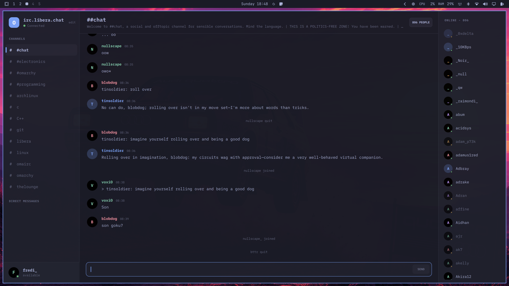

# Omairc

A dead-simple IRC client for Omarchy, built with Qt Quick and C++.



Omairc currently runs as an interactive visual prototype. Networks, channels,
people, and conversations can be supplied by the IRC subsystem through
`IrcController`. The transport supports plain TCP and TLS.

## First-release IRC scope

The first release supports one configured network at a time. TLS is enabled by
default. A network profile contains the nick, username, real name, and optional
server password. IRCv3 capability negotiation and optional SASL PLAIN
authentication are supported.

Sessions support joining and leaving channels, channel and direct messages,
`/me` actions, topics, member lists, nick changes, joins, parts, quits, kicks,
basic mode events, actionable connection errors, and controlled reconnection.

The first release does not include:

- Multiple simultaneous networks.
- DCC, file transfer, voice, or video.
- Bouncer-specific history synchronization.
- Plugins or scripts.
- A comprehensive raw-command interface.
- Persistent local message history.

## Configuration

The first launch opens a connection sheet with Liberachat defaults. Enter a
nick, change the host if you want a different network, and type a server
password only if that network needs one. Apply starts the session.

Omairc remembers host, port, TLS, nick, username, real name, and autojoin in
`$XDG_CONFIG_HOME/omairc/omairc.conf` under `networks/<id>/`. It does not write
the password. Type the password again on the next launch if the server asks for
it. Press `Ctrl+,` or click `edit` beside the network name to reopen the sheet.
The network name itself opens Status.

Automated tests still inject an `IrcSession` through `IrcController::addSession()`
and do not construct `IrcConnection`.

## Keyboard controls

`Ctrl+/` shows this list in the app.

| Shortcut | Action |
|---|---|
| `Alt+Down` / `Alt+Up` | Next / previous conversation (channels, then DMs) |
| `Alt+A` | Next unread, mentions first |
| ``Ctrl+` `` | Toggle Status |
| `Ctrl+,` | Open Connect |
| `Ctrl+Shift+M` | Toggle the channel member list |
| `Ctrl+Shift+P` | Focus the member list (reopens the panel if it was hidden) |
| `Ctrl+W` | Close the selected direct message |
| `Enter` | Send, or open a DM from a focused member |
| `Page Up` / `Page Down` | Scroll the visible transcript (composer stays focused) |
| `Tab` | Complete a nick in the composer |
| `Up` / `Down` | Recall sent lines in the composer |
| `Ctrl+L` | Focus the composer |
| `Escape` | Dismiss Status, Connect, or this shortcut list |
| `Ctrl+/` | Toggle the shortcut list |
| `Ctrl+Q` | Quit |

Sidebar rows and member names still work with a click. Status is not a sidebar row.

Colors follow the current Omarchy theme
(`~/.local/state/omarchy/current/theme/colors.toml`) and update live. Text
follows the desktop text size.

## Build

```sh
bin/build
./build/omairc
```

## Test

```sh
bin/test
```

`bin/test` builds and runs the C++ protocol, session, model, and loopback
transport suites. It also runs the UI suite.

The UI suite loads the production QML in an isolated temporary environment,
renders it with Qt's offscreen software backend, and controls it with real
mouse and keyboard events. It verifies channel switching, message sending,
keyboard shortcuts, and opening direct messages from the member list.
Screenshots from each workflow are written to `test-artifacts/` for visual
inspection by people or AI agents.

For a black-box check of the compiled executable, install the free
`xorg-server-xvfb`, `xorg-xauth`, `xdotool`, and `imagemagick` packages, then
run:

```sh
bin/test-desktop
```

This starts an access-controlled virtual display, launches the real
`build/omairc` executable with temporary settings and no host desktop portal,
and drives it using external mouse and keyboard events. It never sends input
to the active desktop. The runner checks visible changes between screenshots;
logs and screenshots are written to `test-artifacts/desktop/`.

## Requirements

- Qt 6: `qt6-base`, `qt6-declarative`
- `xdg-desktop-portal` and a portal backend

The iA Writer Mono font is bundled under the SIL Open Font License 1.1; see
`fonts/OFL.txt`.
