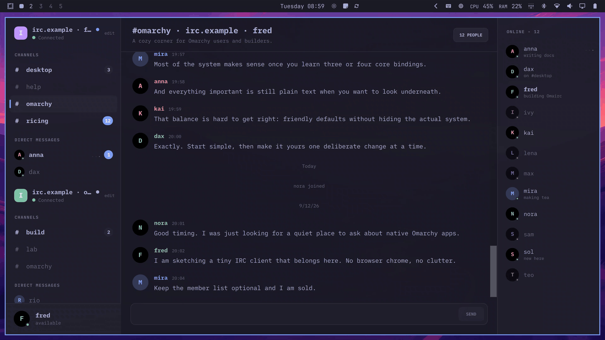

# Omairc

A dead-simple IRC client for Omarchy, built with Qt Quick and C++. Agents talk to the running window over `$XDG_RUNTIME_DIR/omairc.sock`. Humans use the same binary.



## Features

- AI-friendly local CLI. While the window runs, the same binary prints one JSON line and exits: `connections`, `status`, `send`, `conversations`, `read`, `names`, `raise`. None of them change the selected conversation or clear the GUI badges.
- Several networks in one window. Each keeps its own channels, direct messages, nick, and connection state, plus a Status console that holds the handshake, AUTH, and errors.
- Connect sheet on first launch. Name and Libera Chat host defaults, TLS on, autojoin `#omarchy`. NickServ is SASL PLAIN when the server offers it, otherwise `IDENTIFY`. Nothing connects on its own unless you ask it to.
- Channels and direct messages. Member panel and people count on channels only. Click a nick to open a DM, `Ctrl+W` to close it. When the network grants `draft/metadata-2`, member and nick circles can show an avatar, a standing status line, and a small bot mark.
- Keyboard first. `Ctrl+/` lists the shortcuts: `Ctrl+K` jump, `Ctrl+Shift+K` nick, `Alt+A` next unread, `Ctrl+F` find, Tab nick complete, Up/Down history, and drafts that stay with each conversation.
- Slash commands from the composer, with complete after `/`. The usual set plus `/status`, `/avatar`, `/autoaway`, `/ignore`, `/monitor`, `/mute`, `/highlight`, and CTCP `/ping`, `/time`, and `/version`, which query a nick. Replies copy into the asking transcript, like `/whois`. `/status` and `/avatar` set standing metadata; empty `/status` or `/avatar` shows the current value (avatar URLs are clickable). `/status clear` and `/avatar clear` unset when they are the only token. They are not `/away`. `/autoaway` is a client idle timer for every network (off by default; durations are minutes unless given `s`/`m`/`h`); it is not `/status` and does not replace `/away`. `/list [mask]` opens a searchable channel directory for the focused network (same overlay family as `Ctrl+K`). Rows show name, user count, and topic. Enter joins. The last LIST for each network stays in memory until disconnect, so a second `/list` with the same mask is instant; `/list` while the overlay is open refreshes. Results are not dumped into Status.
- Desktop notification for a mention or DM while the window is unfocused. Activating it raises the window and opens that conversation.
- Colors follow the current Omarchy theme and update live. When that theme file is missing, Omairc uses a built-in dark or light palette. Text follows the desktop size.
- Backlog on arrival. A joined channel asks for its last 100 lines over `CHATHISTORY`, a ZNC bouncer's `znc.in/playback` replay is folded in on attach, and a restart reloads the last 2000 lines from the local log as muted backlog.
- IRCv3 `sasl`, `sts`, `echo-message`, `server-time`, `multi-prefix`, `away-notify`, `MONITOR`, `draft/metadata-2`, `draft/ICON`, `message-tags`, `labeled-response`, `chghost`, `cap-notify`, `batch`, `chathistory`, and `znc.in/playback`. When a network advertises `draft/ICON`, the sidebar network square can show that icon. Reconnects with backoff.
- Profiles in `$XDG_CONFIG_HOME/omairc/`. Passwords and NickServ secrets go through QtKeychain into Secret Service; without that service they stay session-only and Connect says so. Logs and errors land in `$XDG_STATE_HOME/omairc/`.
- One process. A second launch raises the existing window.

## Limits

- SASL is PLAIN only, and Connect has no separate SASL account or bouncer-network fields.
- No DCC, file transfer, voice, video, plugins, or scripts.
- No Soju or ZNC history-sync protocol. Omairc asks for and accepts server history, but it does not drive a bouncer's own sync commands.
- The local CLI controls the running window. It is not a second IRC client.

## Install

On Omarchy or another Arch-based system, install the latest release with one
command:

```sh
curl -fsSL https://raw.githubusercontent.com/fredimachado/omairc/master/install.sh | sh
```

That adds the `[omairc]` pacman repository, pointed at the latest GitHub
release, and installs it. It is safe to re-run: the repository is only added
once, and later runs upgrade to the newest release. Read
[`install.sh`](install.sh) before piping it if you prefer. The same script is
also published as a release asset, so the version-pinned form works too:

```sh
curl -fsSL https://github.com/fredimachado/omairc/releases/latest/download/install.sh | sh
```

After the repository is configured, upgrades go through pacman as usual:

```sh
sudo pacman -Sy omairc
```

On Omarchy you can also run `omarchy pkg add omairc`.

Build from source instead:

```sh
git clone https://github.com/fredimachado/omairc.git
cd omairc
./bin/install
```

Run that as your regular user. `makepkg` calls `sudo` when it needs to.

Or install a [release package](https://github.com/fredimachado/omairc/releases/latest) directly:

```sh
sudo pacman -U omairc-*.pkg.tar.zst
```

Depends on `qt6-base`, `qt6-declarative`, `qt6-svg`, `qt6-wayland`, `qtkeychain-qt6`, and `xdg-desktop-portal`.

Packagers stage with qmake `INSTALL_ROOT`, not `DESTDIR`:

```sh
qmake6 PREFIX=/usr
make
make INSTALL_ROOT="$pkgdir" install
```

Default `PREFIX` is `/usr/local`. Prove the staged tree with `bin/test-install`. `version.pri` is the only version string; tag a release as `v` plus that value. Arch `pkgver` cannot contain hyphens, so pre-releases use `0.8.3alpha` rather than `0.8.3-alpha`.

Omairc is MIT. See `LICENSE`. The IRC protocol code in `src/irc/` is LGPL-3.0-or-later. The bundled iA Writer Mono font is OFL-1.1.

## Agent skill

```sh
npx skills add fredimachado/omairc/skills -g
```

That installs the local CLI skill for this user (Cursor, Claude Code, Codex, and other agents the Skills CLI supports). The window must already be running. Preview with `--list`.

## Build

```sh
bin/build
./build/omairc
./build/omairc --demo-server
./build/omairc --help
./build/omairc send --network <id> '#channel' hello
./build/omairc read '#channel' --since 5m
./build/omairc read --unread
```

`--demo-server` seeds an in-process session and skips Connect. `--help` and `--version` print plain text and exit without a window; after a send target they are message text. Quote channel targets, since `#` starts a shell comment.

Control commands need a running window. With exactly one connection, `--network` may be omitted. Default `read` is `--last 50`, capped at 100; `--last`, `--since`, and `--unread` do not combine. `--unread` uses a CLI cursor under `$XDG_STATE_HOME/omairc/cli-cursors/` that agents on this machine share, separate from the GUI unread counts.

Set `OMAIRC_ALLOW_MULTI=1` if you need more than one normal process while debugging.

## Test

```sh
bin/test
bin/test-san
bin/test-install
bin/test-desktop
bin/test-live
```

`bin/test` is the default gate: conventions, build, CLI help and version, the C++ suite, and the offscreen QML tests. CI also runs `bin/test-san` (ASan and UBSan) and `bin/test-live`.

`bin/test-desktop` is optional and needs `xorg-server-xvfb`, `xorg-xauth`, `xdotool`, and `imagemagick`. `bin/test-live` is optional and needs Docker; it drives Ergo, Solanum, and ngIRCd on loopback, then the dual-network production-QML proof.

## Windows

Omarchy is the home. A native Windows build is a bonus: it works, it is not the focus, and why not.

Each version tag also publishes `omairc-*-windows-x64.zip` and
`omairc-*-windows-x64-setup.exe` on the
[GitHub release](https://github.com/fredimachado/omairc/releases/latest).
The installer is per-user by default (no admin): Start Menu, user PATH, and
`%LOCALAPPDATA%\Programs\Omairc`. Unzip the zip and run `omairc.exe` if you
want a portable tree. Pull-request and `master` CI compile and smoke the
portable tree but do not package the installer; use a manual workflow run
when you need the zip or setup.exe.

From the repo root:

```bat
bin\build.bat
build\release\omairc.exe
build\release\omairc.exe --demo-server
build\release\omairc.exe --help
bin\package-windows.bat
```

The exe is a GUI process, so Explorer and the Start Menu do not flash a console, and a terminal prompt comes back as soon as the window is up. `--help`, `--version`, and control commands attach to the parent terminal when they need to print. Interactive `--help` / `--version` from cmd or PowerShell can print after the next prompt, because Windows does not wait for a GUI-subsystem process; redirected capture (`> file`, PowerShell `2>&1`) still works. Git Bash / mintty is not a Windows console, so `AttachConsole` fails there and those commands can print nothing unless you run them from cmd or PowerShell.

`bin\build.bat` finds a Qt 6 kit (MSVC preferred, then MinGW), loads the MSVC toolchain when needed, builds into `build\release\`, and runs `windeployqt`. The MSVC CRT DLLs (`msvcp140`, `vcruntime140`) are copied from `VCToolsRedistDir`, not from `windeployqt --compiler-runtime`. Set `QMAKE` to pick a kit. QtKeychain must be installed for that kit. Opening `omairc.pro` in Qt Creator still works. `bin\package-windows.bat` needs Inno Setup 6 (`ISCC.exe`) and writes `dist\omairc-*-windows-x64-setup.exe`.

The same exe is the local CLI. Start the window first, then `omairc.exe connections`, `send`, `read`, and the rest from another terminal. On Windows there is no `omairc.sock` file; the client listens on a named pipe.

Compared with Linux you will miss portal text scale (stays 1.0), desktop notifications, the Omarchy theme watch when `colors.toml` is absent, the pacman/`bin/install` path, and the UI / desktop / live test runners. Profiles land in the Qt app config location instead of `$XDG_CONFIG_HOME`. For a copied tree, also copy OpenSSL next to the exe when the kit is OpenSSL-backed (typical MinGW) so TLS to Libera Chat works.

## macOS

Omarchy is the home. A native macOS build is a bonus: it works, it is not the focus, and why not.

Install the notarized GitHub `.app` with Homebrew:

```sh
brew tap fredimachado/omairc https://github.com/fredimachado/omairc
brew install --cask fredimachado/omairc/omairc
```

The extra tap URL is required because this repository is `omairc`, not `homebrew-omairc`. That puts Omairc in `/Applications` and `omairc` on `PATH` so the local CLI works from a terminal. The window still has to be running. Uninstall leaves profiles and logs; `brew uninstall --cask --zap omairc` is the wipe.

Once Homebrew carries the cask, this is enough:

```sh
brew install --cask omairc
```

Each version tag also publishes `omairc-*-macos-arm64.zip` (Apple Silicon) and `omairc-*-macos-x64.zip` (Intel) on the [GitHub release](https://github.com/fredimachado/omairc/releases/latest). Unzip that if you want a portable tree. Pull-request and `master` CI compile and sign but do not upload zips; a manual workflow run and version tags still package them. Intel pull requests also skip the portable test rebuild (Linux and Apple Silicon still run it). CI signs the bundles with Developer ID. Version tags (and a manual workflow run) notarize, staple, and Gatekeeper-assess the app; Apple's first look at a new Developer ID can sit in progress for hours, so pull requests do not wait on that. Local Homebrew-Qt builds stay ad-hoc.

From the repo root on macOS:

```sh
brew install qt@6 qtkeychain cmake
export PATH="$(brew --prefix qt@6)/bin:$PATH"
# Homebrew's qtkeychain formula has no qmake module; either rely on brew
# discovery in qtkeychain.pri, or build a local copy into .deps:
#   bin/install-qtkeychain "$PWD/.deps/usr"
bin/build-macos
open build/omairc.app
build/omairc.app/Contents/MacOS/omairc --demo-server
build/omairc --help
```

Homebrew Qt builds skip `macdeployqt` (its framework layout can hang dyld) and keep linking against the brew prefix, so leave `qt@6` on `PATH` when you run the app. For a relocatable zip, install Qt 6.8 with [aqtinstall](https://github.com/miurahr/aqtinstall) the way CI does (prefers `clang_arm64` on Apple Silicon with a universal `clang_64` fallback when aqt has no arm64-only kit; `clang_64` on Intel), build QtKeychain into that prefix with `clang++`, then run `bin/build-macos` and `bin/package-macos`. `bin/build-macos` generates `data/icons/omairc.icns`, runs `qmake` + `make` into `build/omairc.app`, on non-Homebrew kits runs `macdeployqt`, and signs with Developer ID when `CODESIGN_IDENTITY` is set (otherwise ad-hoc). `bin/package-macos` writes `dist/omairc-*-macos-*.zip`. `bin/notarize-macos` submits that zip to Apple, waits, and staples.

The same binary is the local CLI. Start the app first, then run `omairc connections`, `send`, `read`, and the rest from another terminal. The Unix socket lives under Qt's `RuntimeLocation` (typically `~/Library/Caches/TemporaryItems/` or `$TMPDIR`), not `$XDG_RUNTIME_DIR`. Passwords use the macOS Keychain through QtKeychain instead of Secret Service.

Compared with Linux you will miss portal text scale (stays 1.0), Freedesktop D-Bus notifications and theme hooks, the Omarchy `colors.toml` watch when that file is absent, the pacman/`bin/install` path, Wayland/portal integration, and the desktop/live test runners. Profiles land in `~/Library/Preferences/omairc` and logs in `~/Library/Preferences/State/omairc` (Qt `GenericConfigLocation` / `GenericStateLocation`), not `$XDG_*`.
