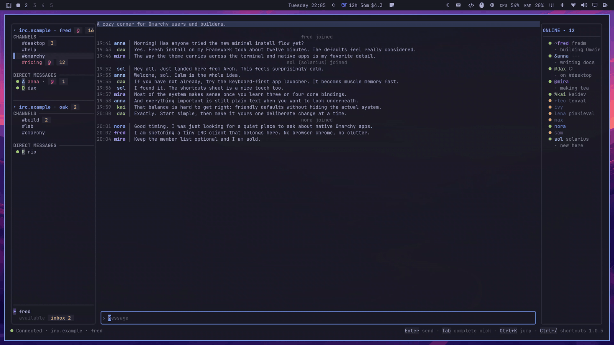

# Omairc TUI

The Go terminal client. Same behavior, chords, and window title as the Qt app.



## Build

```sh
tui/bin/build
tui/bin/omairc-tui
tui/bin/omairc-tui --demo-server
```

`--demo-server` seeds the two-network demo world and skips Connect.

## Test

```sh
tui/bin/test
```

Contributor notes are in [AGENTS.md](AGENTS.md).
